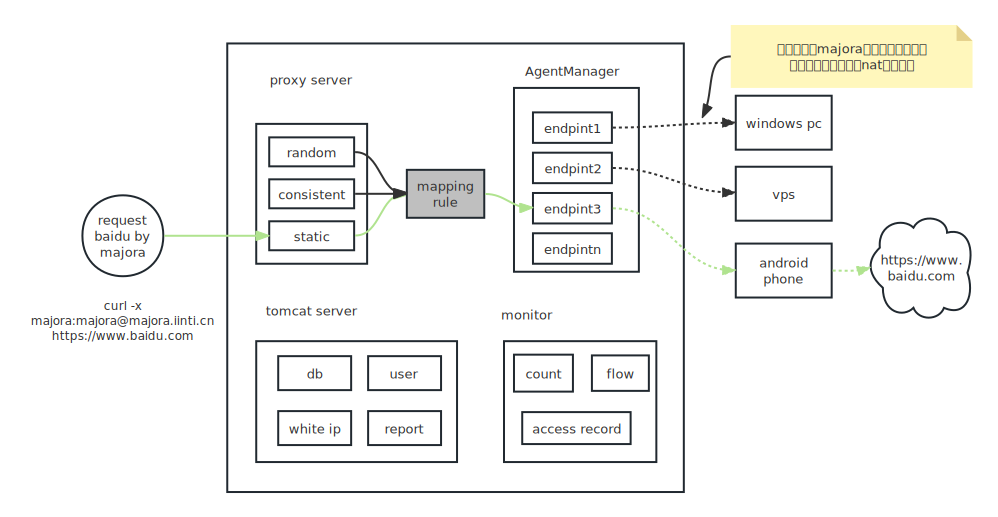

# 概念说明
Majora是一个快速搭建代理ip池集群的中心化系统。如下图，只需要部署一台服务器，然后在各个网络设备上面安装终端（endpoint），即可自动的组件代理ip资源池。

在不展开技术细节的情况下，希望读者了解下图的简单示意图，理解majora的大概工作模型，如此可以更好的使用majora的能力。

## majora服务
majora提供了多个端口，每个端口都是一个服务器实现，包括代理服务和tomcat的后端服务两大类。

其中代理服务包括 random、consistent、static三种，每种服务可拥有多个端口，每个端口都可以提供代理服务。

其中tomcat服务则是一个标准的java后台服务器，实现基本的业务管理功能，如数据库、多用户体系、报表监控入库、白名单配置等

### 代理服务
Majora的代理服务是在中心服务器统一实现的，所以代理本身的功能就非常容易实现：

- 代理账户变更：新增/删除代理账户、密码变更、白名单变更等，并且这些变更是立即生效，而不需要等几分钟时间同步才能生效
- 代理使用统一监控：流量、次数、访问网站等。所有数据都在中心服务器产生，不需要分布式节点收集
- 状态一致性：任何网络终端节点崩坏，均在毫秒内被感知，因为都是tcp长链接，不会出现某个代理被判定可以使用实际上无法使用的情况。
- 服务稳定性：统一的服务器提供隧道代理，节点上下线不需要客户端感知（需要提取ip的方式本质就是开发水平不太够，他提供是代理ip池的元数据服务，而不是代理服务）

### tomcat服务
这是一个springboot实现的java后台，他提供前端html渲染空间、restfulAPI、监控报表、配置管理等功能

## 终端节点
由于我们是统一的中心服务，此时终端节点只需要能够链接上服务器即可构建IP池，所以终端节点的网络位置并不重要。这让我们的集群架构变得非常简单，

- 我们不需要为每个终端做复杂的配置，只需要给他指定majora中心服务器地址一个参数即可
- 任意位置的网络设备均可以安装，不需要考虑网络运维环境
- 自带内网穿透功能，让ip池的出口渗透到手机、app、pc软件集成、路由器等没有公网ip的环境下。极大扩充ip池的业务场景

所以我们提供了各种场景下的终端接入：

- 各种系统环境：Linux、windows、macos等PC环境，以及openwrt路由器环境
- Android app环境集成（PS，IOS本质上也可以实现，但是可能不合规，暂不提供）
- sdk集成，用于客户手动往现存的业务中接入，如集成到某个app中。目前只提供了java的sdk，其他sdk看客户需要再来实现

## mapping rule
在左侧，majora提供了一组代理服务器端口，每个端口都是提供了代理能力。

在右侧，majora接受终端设备的链接，每个终端设备均和majora建立一个数据传输隧道，然后在majora系统中存在一个endpoint对象来描述他。endpoint具备和真是的物理出口设备进行通信的能力。

代理请求发生过程，本质是左侧的代理服务器接收到代理请求，经过解析后使用某个endpoint进行流量代发。最终让终端和目标网站进行真实交互的一个过程。

此时，选择哪一个endpoint，则会决定当前的代理请求使用那个出口ip，则在业务上可能比较重要，因为业务本身不光是要求出口ip被替换、并且可能对出口ip有要求，所以我们有mapping rule来决定这个选择关系。

- random： majora提供一个端口作为random代理服务器，由于该服务器被标记为random，所以在进行endpoint选择时，他会完全随机的从可用endpoint列表中选择一个。这表现为每次访问均是不一样的出口ip，这适合只对出口ip有限制的业务场景，而不需要考虑同一个session多个请求ip不变
- static： 每个endpoint均可以绑定一个端口，此时这个端口将会开启代理服务，并且对应的代理服务将会只为本endpoint服务，即通过本代理服务器接受到的请求，将会永远选择和他绑定的endpoint对象。
- consistent：这是默认策略，所有的一致性哈希代理服务作为一个哈希环、所有的endpoint作为一个哈希环，在进行endpoint选择是，根据服务器的哈希映射到endpoint哈希环，确定endpoint。这样尽可能多次访问ip不变，并且当ip出现下线的情况依然可以找到可用IP

**[强烈推荐读者了解一致性哈希的原理，并且利用一致性哈希规则实现ip选择路由方案](https://baike.baidu.com/item/%E4%B8%80%E8%87%B4%E6%80%A7%E5%93%88%E5%B8%8C/2460889?fr=aladdin)**