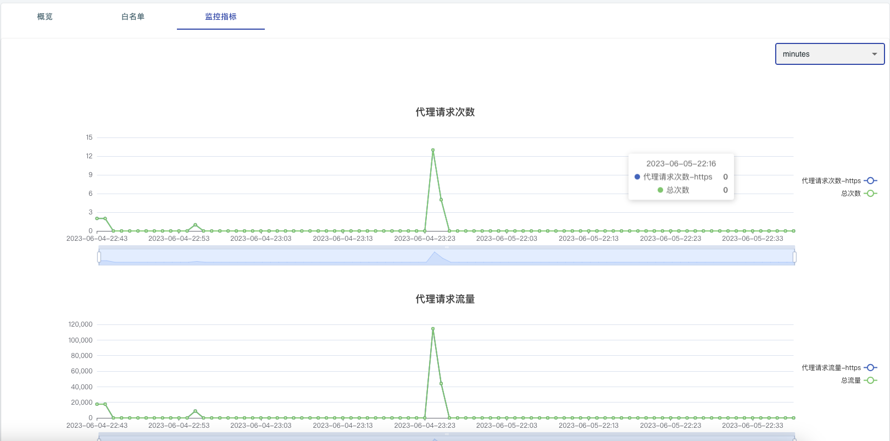

# 服务器运维
majora后台提供非常完善的后台管理和报表功能，完成对资源、权限的隔离和控制能力。

## 个人相关

### API Token

majora的服务API，均通过swagger提供，你可以通过swagger自己定制前端皮肤(如下，点击图片跳转到swagger页面)，在调用restfulAPI的时候，大多数接口可能存在权限授权，
此时我们通过APIToken进行授权，APIToken每个账户不一样，并且可以唯一定位到对应账户。非常适合在代码中进行授权访问。

### 代理鉴权账户
对于公司业务来说，一般希望后台管理账户和代码调用账户分离，因为当代码需要使用代理服务的时候，我们大概率需要将代理账号/密码写到代码中，这样拥有代码权限的同学即可掌握后台权限，
此时后台的数据则可能被泄漏或者越权。

故这里为代理访问单独设定了一套专用权限，你可以手动设置代理鉴权账户/密码，此时这个账户密码仅能通过http代理的方式访问majora代理服务，而无法通过这个账户登入majora后台，
此时代理账户/密码可以安全的写到代码文件中，避免权限泄漏问题。

当然如果你不需要做后台账户/代码账户隔离，那么不设置代理鉴权账户，系统默认则使用后台账户作为代理使用的账户体系。

### 白名单
- 有可能有需求只希望固定服务器可以访问代理ip资源：毕竟通过密码的方式，密码一旦被其他人拿到那就可以随意使用代理服务
- 可能我们的场景无法填写密码的方式使用代理资源：如Android webview的代理设定，没有设置账号密码的API

此时majora提供ip白名单的方式进行代理鉴权，满足来源ip规则的请求将会被放行。白名单添加可以通过APIToken进行接口操作添加，所以我们可以通过代码自动维护白名单ip列表（即APIToken换白名单）

白名单有以下特性：

1. 白名单支持网段形式对一个ip段进行批量授权，即CIDR规则，具体请参考CIDR规则描述
2. 白名单是有固定数量限制的，超过最大限制的白名单填写时，将会出现冲突，之后满足如下冲突处理规则
   1. 白名单区分后台添加和API添加两种方式：即APIToken通过代码录入为API添加、通过网页后台录入为后台添加
   2. 后台添加具备被API添加更高的优先级，当ip白名单配额超限时，删除最老加入的API白名单，然后在进行添加流程
   3. 如果所有的白名单都是后台白名单（而不是API白名单），则添加失败
3. 白名单配合在超级管理员的设置页面进行设置

### 监控指标
对于本账户，我们提供一些账户级别的监控图表，用于审查系统资源使用情况

## 终端
所有安装majora客户端的，提供网络出口的设备，在majora系统中被称作终端，终端是实际提供网络出口服务（代理功能）的设备。
即：手机app、vps拨号节点、adsl拨号pc等。

- 所属用户：每个终端都可以绑定一个对账用户，如果多个团队/公司共同构建majora代理ip池，则通过所属用户（vendor）则可进行供应侧供应量计量对账
- 固定端口：如果某条隧道代理确定绑定终端，则可以给终端配置固定端口。此时：端口<-->设备终端 将会是一个一一对应关系，这非常适合用来实现长效代理（如实效长达小时级别的长效代理）
- 出口ip：当前用户的出口ip，以此统计当前终端产生的真实ip
- 在线状态：如果终端设备断开和majora服务器的链接，则他会被标记为离线，离线设备无法提供代理服务，且长期离线会被majora清理
- 总流量：从终端设备角度，统计本终端总共供应的代理流量

对于每个终端，我们可以终端详情看到更加丰富的数据，包括终端远端情况，基本参数、监控面板，供应流水等。

## 代理池

majora通过多个端口提供隧道代理服务，一般情况下不同的端口代表这不同的代理出口，当然端口也有不同的类型。

- 随机出口：被标记为随机出口的端口，使用本隧道将会每次请求随机选择终端设备，也即不同请求将会随机选择ip池的IP资源，达到随机出口ip的特性
- 静态绑定出口：存在静态绑定设备的端口，使用本隧道转发的代理将会选择他所绑定的出口，也即他会固定某个确定的出口IP，这非常适合建设长效IP
- 一致性哈希出口：非上述两种类型的端口，则为一致性哈希代理服务，一致性哈希映射实现端口和设备的弹性绑定，**一致性哈希映射是majora推荐的使用方式，他均衡了ip平均分布+ip出口确定不变+设备离线服务无影响的特点**
  - 在设备没有出现大范围的离线或者在线条件变化的情况下，某个端口将会确定的使用某个设备出口，多次访问保证对应关系不变
  - 端口和设备的对应关系是一种平均的，等概率的映射，一般情况情况下不会出现分布不平均问题
  - 同一个端口，在不同的majora系统子账户情况下，对应关系隔离
  - 新设备加入，或者某个设备离线，整体对应关系基本不变，但是可能涉及到很小的对应关系发生变化。但是这个小概率的变化对于正常业务来说，可能真的就是ISP的正常策略切换概率。

## 日志和账单
- 通过日志模块，我们可以看到每个用户访问了何种网站，该记录按小时聚合，我们可以对整体的业务使用规范问题进行溯源和控制，防止用户滥用线上资源。
- 通过账单模块则是精细化的查看每个账号/供应方的流量使用和供应，一方面他可以用来进行使用量的监控，另一方面可以用来做成本的核算和对账。

## 系统监控
系统监控提供整个系统级别的监控报表，这可以形象的反应majora的业务现状

- 在线设备数： 即有多少终端链接到majora系统
- ip产生量（24小时消重）：作为一个ip池，核心表达有多少ip资源产生，他和终端不是相同的概览，因为可能多个终端在同一个局域网下，这会导致可能多个终端产生相同的出口ip资源
- 代理请求次数：majora系统所有的代理链接转发次数，即服务代理业务的次数，这里区分http/https/socks5不同协议的代理请求次数情况
- 代理请求流量：从流量的视角，观察majora转发的代理请求报文占用的流量大小
- tcp链接量：基本等驾驭http/https/socks5的数据量叠加
- 等等其他未来可能添加的指标。

## 多账户
majora允许注册多个账户，此时多个账户均可以访问代理服务，以及登如到majora后台，majora可以在不同账户下做业务隔离。
- 设置各自的鉴权参数：代理账户密码/ip白名单
- 观察各自的业务使用情况：代理ip使用报表、ip访问监控、代理访问日志记录
- 代理供应情况
- ip访问quota控制（todo）等

## 系统面板

对于管理员，majora提供多种系统设置参数，这些参数控制了majora各种灵活策略，每个设置项在后台都有相关描述，读者可以根据相关的描述了解含义。
如果相关疑问，可以咨询我们的客服

