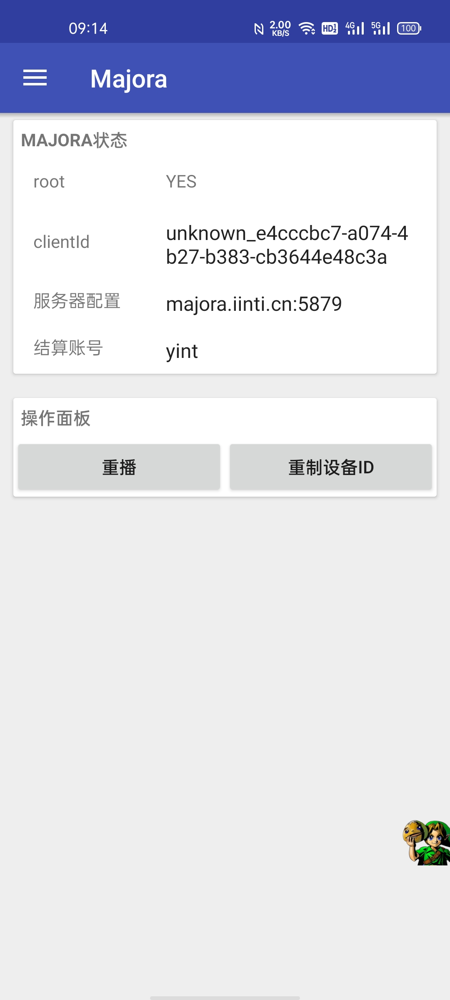
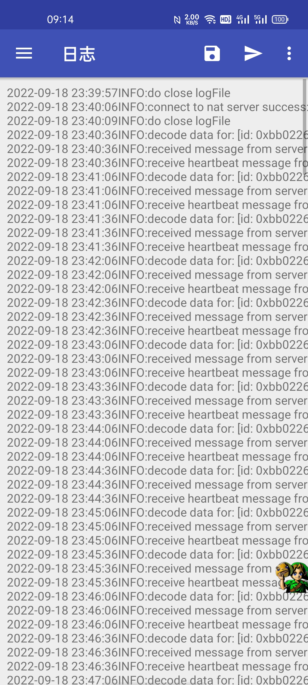
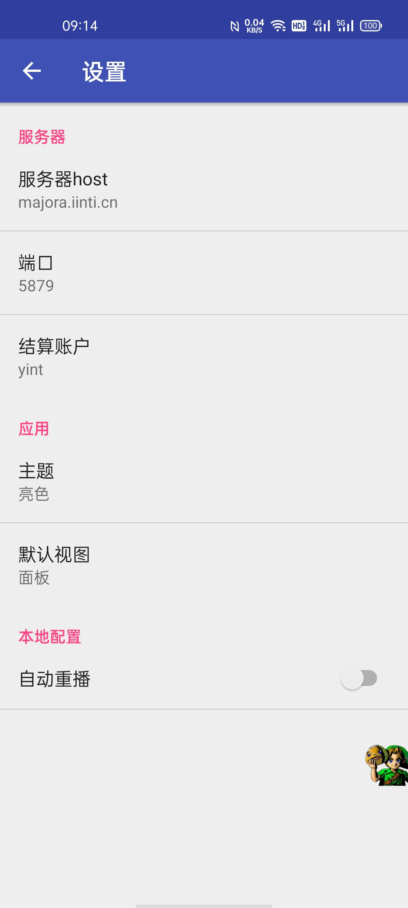
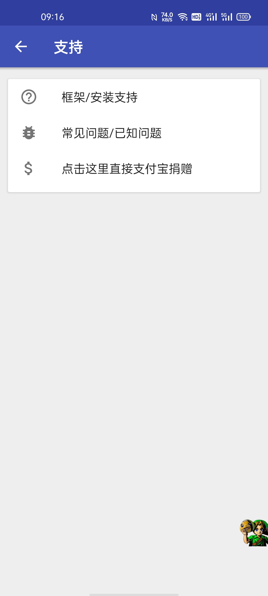

# android app

## 下载
**下载地址：[https://oss.iinti.cn/majora/majora-client-android](https://oss.iinti.cn/majora/majora-client-android)**

majora提供了一个默认的APK客户端实现，使用它你可以方便的手机4G代理ip资源。这个app是开源的，你可以根据自己的需要进行定制，也可以参考他进行自己的app的sdk集成工作

## 首页面板

<ul style="display: inline-block">
<li >root状态：显示本手机是否有root</li>
<li >clientId:唯一的设备id</li>
<li >服务器配置：链接的中心服务器</li>
<li >结算账号：用来实现对账的账户</li>
<li></li>
<li>重播：可以手动发起重播</li>
<li>重置设备id：重新生成clientId</li>
<li></li>
<li>重播面板：root并且开启自动重播才显示</li>
<li>控制重播时间间隔</li>
</ul>

## 日志面板

<ul style="display: inline-block">
<li >文件图标：支持存储日志</li>
<li >飞机图标：支持发送日志到其他app</li>
<li>右上角菜单：</li>
<ul >
<li>清理日志</li>
<li>刷新日志</li>
<li>滚动日志</li>
</ul>
</ul>

## 设置面板

<ul style="display: inline-block">
<li >root状态：显示本手机是否有root</li>
<li >clientId:唯一的设备id</li>
<li >服务器配置：链接的中心服务器</li>
<li >结算账号：用来实现对账的账户</li>
<li></li>
<li>重播：可以手动发起重播</li>
<li>重置设备id：重新生成clientId</li>
<li></li>
<li>重播面板：root并且开启自动重播才显示</li>
<li>控制重播时间间隔</li>
</ul>

## 关于和支持面板

<ul style="display: inline-block">
<li >一些关于链接</li>
</ul>

## 使用shizuku实现免root的飞行模式重播

在使用Android收集作为majora客户端时，定时重播或者被业务管理的重播是比较重要的支持。在Android中重播即飞行模式的切换。
然而由于飞行模式切换是一个高阶权限，随着Android版本不同具备不同的行为拦截，故majora app目前只能在满足一些条件才可以执行飞行模式切换动作。

### Android各版本飞行模式约束和重播方案选定
* 低版本（约小于Android5.0），使用广播命令重播，无限制
* 中版本（约Android 5.0-9.0），重播广播将会被系统过滤拦截，除非广播发出者是root/system身份。
    * adb可以写settings，然而settings仅仅针对于系统的设置页面，并没有触发底层网卡重启流程，此时在app界面看到似乎飞行模式打开了，然而实际上并没有底层行为，重播不生效
    * 只能使用广播发起飞行模式，但是adb级别权限也会被系统拦截。故此时手机必须root才能重播
* 高版本（大于10），此时使用cmd命令触发重播
    * root可能比较困难，但是支持adb权限
    * adb权限下，使用cmd connect 命令族完成重播

**总结： 如果完成了root，那么均支持重播； 否则要么Android小于5.0, 要么大于10.0且借助shizuku提权到adb权限**

### shizuku方案引导

- 下载shizuku [https://github.com/RikkaApps/Shizuku/releases](https://github.com/RikkaApps/Shizuku/releases)
- 启动和配置shizuku [https://shizuku.rikka.app/zh-hans/guide/setup](https://shizuku.rikka.app/zh-hans/guide/setup)
- 在shizuku中给majora app授予权限（安装好shizuku再打开majoraApp将会自动发起权限申请）
- 在app面板中，将会看到shizuku可用状态

### 使用root来实现重播
对于当代手机，可以选择如下两种方案

- android版本小于Android12 [Magisk](https://github.com/topjohnwu/Magisk)
- android版本大于Android12 [KernelSU](https://github.com/tiann/KernelSU)