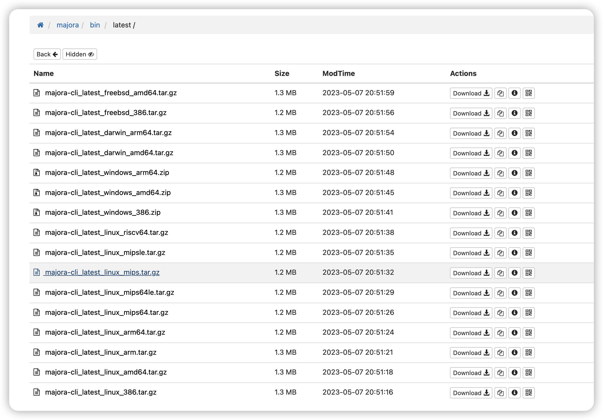
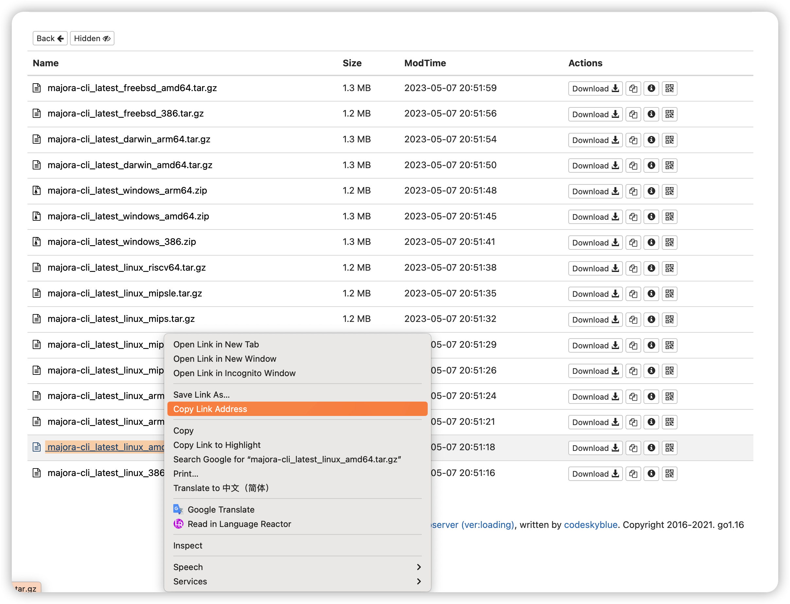

# PC主机环境

对于``windows``,``linux(vps)``,``路由器``等主机环境，请使用参考本章节安装客户端

## 下载
**下载地址：[https://oss.iinti.cn/majora/bin/latest](https://oss.iinti.cn/majora/bin/latest)**, 选择对应的系统版本，点击下载或者复制对应的下载链接，使用`wget`下载

### 直接下载
> 路由器，注意区分大小端


### 使用`wget` 下载
> 复制下载链接 


```
# 下载 
wget https://oss.iinti.cn/majora/bin/latest/majora-cli_latest_linux_amd64.tar.gz

# 解压 
tar -zxvf majora-cli_latest_linux_amd64.tar.gz
```
## 配置 

> 配置文件位置 解压目录下的 `majora.yml`

### 0x00 通用场景 

**可选部分可以不填，或者按需修改**

```yaml
# [必选] majora 服务端的地址，支持域名模式
tunnel_addr: majora.iinti.cn:5879
# [可选] 自定义的dns地址
dns_server: 114.114.114.114:53
# [可选] 日志级别 默认info，可选值(debug/info/warn/error)
log_level: info
# [可选] 连接重试间隔(重播或者服务端升级时,客户端自动重试的间隔) 默认30秒
retry_duration: 30s
# [可选] 自定义网卡, 用于多网卡模式下
intface: en0
```

### 0x01 拨号场景 

- **需要vps支持拨号功能**
- 拨号脚本由vps**运营商**提供 
- 在配置文件中，添加拨号相关的配置，示例如下 
  
```yaml
redial:
  # 重播的cmd 
  # unix/linux 下 /bin/bash 
  # windows 下 CMD
  command: /bin/bash
  # 重播的拨号执行脚本，一般对应的vps提供商会提供 
  # 配置填写绝对路径 
  exec_path: /opt/script/ppe_start.sh
  # 重播的执行间隔 
  redial_duration: 10m
```

### 0x02 完整的配置说明 

```yaml
# [必选] majora 服务端的地址，支持域名模式
tunnel_addr: majora.iinti.cn:5879
# [可选] 自定义的dns地址
dns_server: 114.114.114.114:53
# [可选] 日志级别 默认info，可选值(debug/info/warn/error)
log_level: info
# [可选] 日志路径
log_dir: log
# [可选] 日志文件名 
log_file: majora.log
# [可选] 连接重试间隔(重播或者服务端升级时,客户端自动重试的间隔)
retry_duration: 30s
# [可选] 自定义网卡, 用于多网卡模式下
intface: en0

# [可选] 重播配置 (vps拨号场景，用于换IP)
redial:
  # 重播的cmd 
  # unix/linux 下 /bin/bash 
  # windows 下 CMD
  command: /bin/bash
  # 重播的拨号执行脚本，一般对应的vps提供商会提供 
  exec_path: ppe_start.sh
  # 重播的执行间隔 
  redial_duration: 10m

# [可选] extra 配置 
extra:
  # [可选] 自定义当前节点的账号
  account: majora
```

## Linux环境的启动和服务化

Linux一般使用脚本来启动，同时支持systemd进行进程守护托管和开机自启动

### 0x00 使用脚本 

```
# 配置完 使用start脚本执行 默认守护进程 

./start 
```

示例 


### 0x01 使用`systemd`托管

```
cd /lib/systemd/system
touch majora.service 
vim majora.service 
```

填写以下内容(下载目录有模板，替换实际的`majora`路径即可)

```
[Unit]
Description=majora daemon
After=syslog.target network.target network-online.target
Wants=network.target
Requires=network-online.target

[Service]
Type = simple
# 修改为实际的路径 
ExecStart=/path/to/majora -conf /path/to/majora.yml
Restart=on-failure
RestartSec=5s
KillSignal=SIGQUIT
TimeoutStopSec=5

[Install]
WantedBy=multi-user.target
```

```
# 启动 
sudo systemctl start majora.service

# 查看状态 
sudo systemctl status majora.service
● majora.service - majora daemon
     Loaded: loaded (/lib/systemd/system/majora.service; disabled; vendor preset: enabled)
     Active: active (running) since Fri 2023-05-19 23:10:43 CST; 33s ago
   Main PID: 35659 (majora)
      Tasks: 10 (limit: 4563)
     Memory: 1.6M
        CPU: 34ms
     CGroup: /system.slice/majora.service
             └─35659 /home/go/majora-cli_latest_linux_amd64/majora -conf /home/go/majora-cli_latest_linux_amd64/majora.yml

May 19 23:10:43 rust systemd[1]: Started majora daemon.
# 配置开机启动 
sudo systemctl enable majora.service
```

示例


## windows环境的启动和服务化
在windows环境下，如果将majora服务化，则可以使得majora永久存活，并且开机自启动

- 资源下载：[https://oss.iinti.cn/majora/majora-cli_windows_amd64.zip](https://oss.iinti.cn/majora/majora-cli_windows_amd64.zip)
- 原理：使用[winsw](https://github.com/winsw/winsw/)将majora.exe 注册成Windows服务，
- 同时winsw会配置开机自启动，以及实现故障自恢复、进程守护等。

### 命令行安装
```sh
./service.exe install
./service.exe start;
./service.exe status;
```

### ps1脚本安装

- 选中 "start-win.ps1", 选择”使用PowerShell执行“, 输出日志如下
```log

2023-06-15 11:22:25,101 INFO  - Installing service 'majora_client (majora_client)'...                                   
2023-06-15 11:22:25,121 INFO  - Service 'majora_client (majora_client)' was installed successfully.                     
2023-06-15 11:22:25,969 INFO  - Starting service 'majora_client (majora_client)'...                                     
2023-06-15 11:22:26,307 INFO  - Service 'majora_client (majora_client)' started successfully.                           Started                                                                                                                 
按 Enter 键继续...:        

```

### service.xml 配置如下

```xml

<?xml version="1.0" ?>
<service>
  <id>majora_client</id>
  <description>majora client</description>
  <executable>%BASE%\majora.exe</executable>
  <log mode="roll-by-size">
    <keepFiles>4</keepFiles>
    <sizeThreshold>262144</sizeThreshold>
  </log>
  <name>majora_client</name>
  <onfailure action="restart" delay="1 sec"/>
  <onfailure action="restart" delay="1 sec"/>
  <onfailure action="restart" delay="1 sec"/>
  <resetfailure>1 min</resetfailure>
  <startarguments>-conf majora.yml</startarguments>
</service>
```

详细配置可参考:[XML config file specification](https://github.com/winsw/winsw/blob/v3/docs/xml-config-file.md)